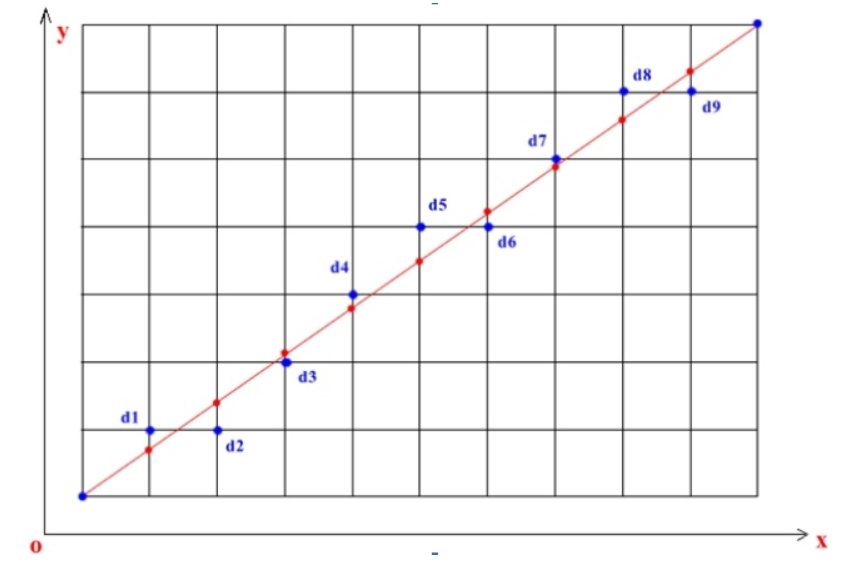
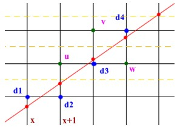
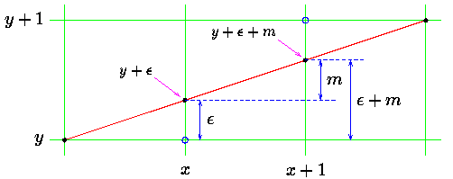
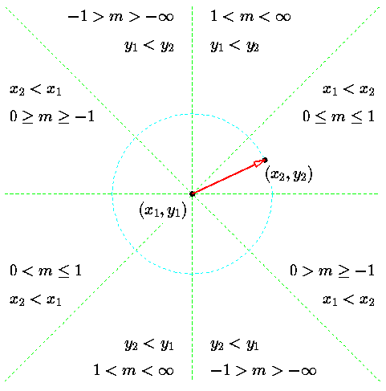

# Bresenham快速直线算法

>engine.c 中 device_draw_line方法解释：

Bresenham 是光栅化的直线算法，或者说是通过像素来模拟直线。比如下图所示像素点来模拟红色的直线。




给定两个起点 P1(x1, y1) | P2(x2, y2)，如何绘制两点之间的连线呢。这里假设斜率约束在0<m<1，那么算法的过程如下：

	1. 绘制起点 (x1, y1) 
	2. 绘制下一个点， X坐标加1，判断是否到终点，如果是则算法完成。否则找下一个点，由上图可知将要绘制的点不是右邻点，要么就是右上邻接点
	3. 绘制点
	4. 跳回第二步骤
	5. 结束

算法具体过程就是在每次绘制点的时候选取与直线的交点y坐标的差最小的那个点:



那么问题聚焦在如何找最近的点，逻辑上每次 x 都递增 1，y 则增加 1 或不增加。具体上图，假设已经绘制到了 d1 点，

那么接下来 x 加 1，但是选择 d2 还是 u 点呢，直观上可以知道 d2 与目标直线和 x + 1 直线的交点比较近，即纵坐标之差小。

换句话说 (x + 1, y + 1) 点纵坐标差大于 0.5。 所以选择 d2 ，其他点也按照该规则执行。



假设以 (x, y) 为绘制起点，一般情况下的直观想法是先求 m = dy /dx（ y 的增量），然后逐步递增 x, 设新的点为 x1 = x + j ，则 y1 = round(y + j * m) 。

可以看到，这个过程涉及大量的浮点运算，效率上是比较低的（特别是在嵌入式应用中，DSP可以一周期内完成2次乘法，一次浮点却要上百个周期）。

下面我们来看一下 Bresenham 算法，如图1, (x, y +ε) 的下一个点为 (x, y + ε + m)， 这里 ε 为累加误差。可以看出，当 ε+m < 0.5 时，绘制 (x + 1, y) 点，

否则绘制 (x + 1, y + 1) 点。每次绘制后， ε 将更新为新值：

            ε = ε + m ，如果 (ε + m) <０.５ (或表示为 2 * (ε + m) < 1 )
            ε = ε + m – 1，其他情况

将上述公式都乘以 dx ，并将 ε * dx 用新符号 ξ 表示，可得

            ξ = ξ + dy，如果 2 * (ξ + dy) < dx
            ξ = ξ + dy – dx，其他情况

可以看到，此时运算已经全变为整数了。以下为算法的伪代码：

```c
	ξ ← 0，y ← y1
	For x ← x1 to x2 do
	　　Plot Point at (x, y)
	　　If (2(ξ + dy) < dx)
	　　　　ξ ←ξ + dy
	　　Else
	　　　　y ← y + 1,ξ ←ξ + dy – dx
	　　End If
	End For
```

在实际应用中，我们会发现，当 dy > dx 或出现上图右侧情况时，便得不到想要的结果，这是由于我们只考虑 dx > dy， 且 (x, y) 的增量均为正的情况所致




c语言的实现：

```c
void draw_line(int x1, int y1, int x2, int y2)
{
    int dx = x2 - x1;
    int dy = y2 - y1;
    int ux = ((dx > 0) << 1) - 1;
    int uy = ((dy > 0) << 1) - 1;
    int x = x1, y = y1, eps;

    eps = 0; dx = abs(dx); dy = abs(dy);
    if (dx > dy)
    {
        for (x = x1; x != x2; x += ux)
        {
            printf("x = %d y = %d\n", x, y);
            eps += dy;
            if ((eps << 1) >= dx)
            {
                y += uy; eps -= dx;
            }
        }
    }
    else
    {
        for (y = y1; y != y2; y += uy)
        {
            printf("x = %d y = %d\n", x, y);
            eps += dx;
            if ((eps << 1) >= dy)
            {
                x += ux; eps -= dy;
            }
        }
    }
}
```