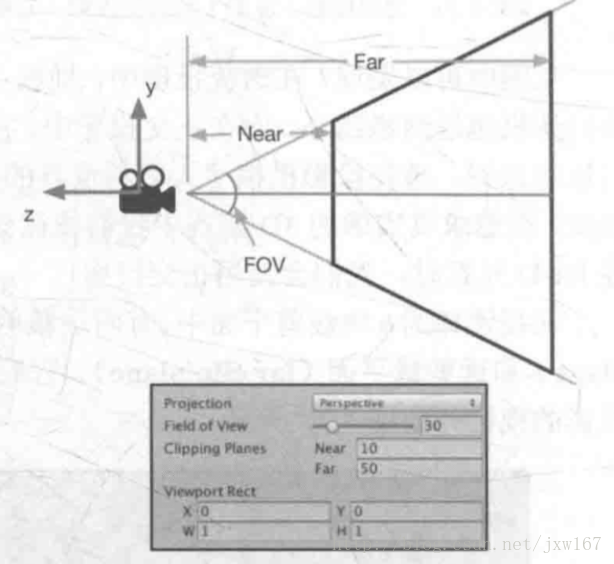
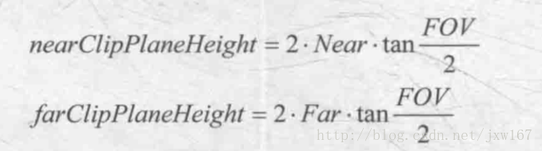
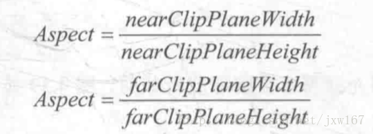
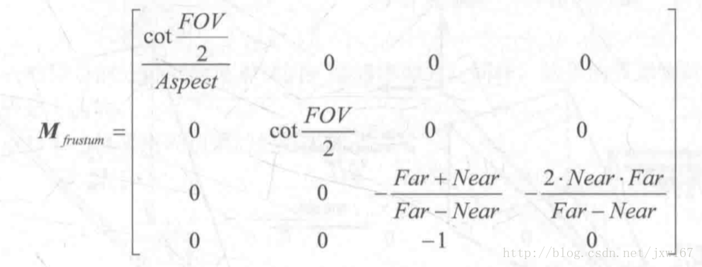
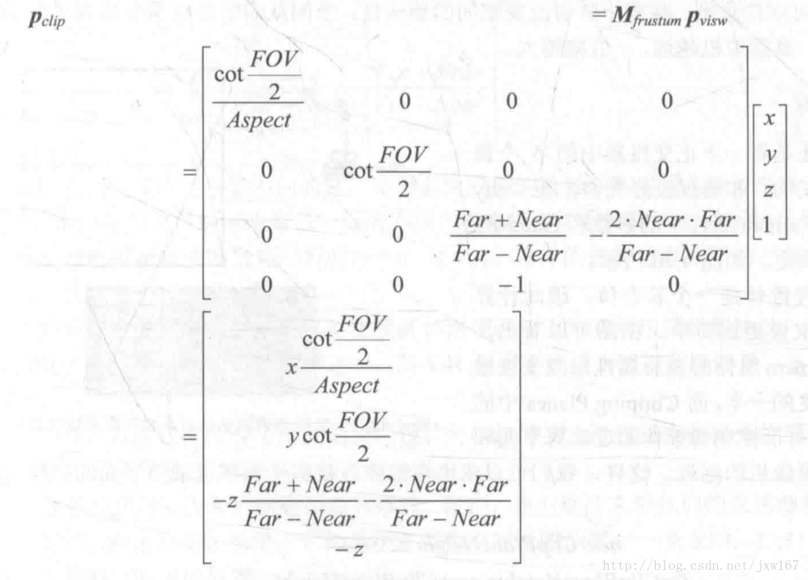
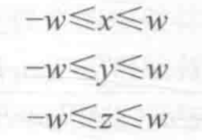
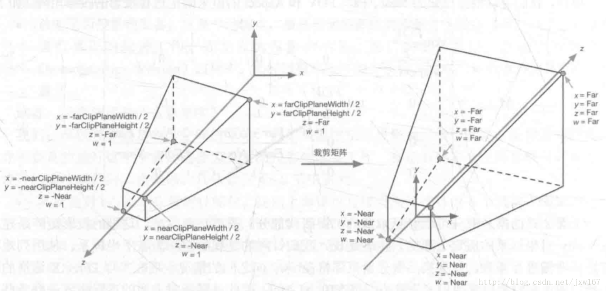

# 齐次裁剪空间

>engine.c 中 clip_polys方法解释：

观察空间道裁剪空间（也被称为齐次裁剪空间），用于变换的矩阵叫做裁剪矩阵，也称为投影矩阵。

裁剪空间的目标是能够方便地对渲染图源进行裁剪：完全位于这块空间内部的图元将会被保留，完全位于这块空间外部的图元将会被剔除，而与这块空间边界相交的图元就会被裁剪。

视锥体指的是空间中的一块区域，这块区域决定了摄像机可以看到的空间，视锥体由六个平面包围而成，这些平面被称为裁剪平面。

视锥体有两种类型，这涉及到两种投影类型：一种是正交投影，一种是透视投影。

在透视投影中，离摄像机越近网格越大，离摄像机越远网格越小。而在正交投影中，所有的网格大小都一样，透视投影模拟了人眼看世界的方式，而正交投影则完全保留了物体的距离和角度。

因此，在追求真实感的3D游戏中，我们会使用透视投影，而在一些2D游戏特别是UI中，选择正交投影。

在视锥体的6块裁剪平面中，有两块裁剪平面比较特殊，它们分别被称为近裁剪面和远裁剪平面。它们决定了摄像机可以看到深度范围。

投影矩阵有两个目的：首先是为投影做准备，虽然投影矩阵的名称包含了投影二字，但是它并没有进行真正的投影工作，而是在为投影做准备。

那投影到底是什么意思？

我们可以理解成是一个空间的降维，比如从四维空间投影到三维空间中，而投影矩阵实际上并不会真的进行这个步骤，它通过齐次除法来得到二维坐标。

其次是对x,y,z分量进行缩放，如果我们直接使用视锥体的6个裁剪平面来进行裁剪会比较麻烦。

而经过投影矩阵的缩放后，可以直接使用w分量作为一个范围值，如果x,y,z份量都位于这个范围内，就说明该顶点位于裁剪空间中。

这里大家要注意一个问题：点的w的分量是1，方向矢量的w分量是0。 经过投影矩阵的变换后，我们就会赋予齐次坐标的第4个坐标更加丰富的含义。

下面给读者展示一下投影矩阵，效果如下所示：

这6个裁剪面由Camera组件中的参数和Game视图横纵比共同决定。我们可以通过Camera组件的Field Of View（FOV）属性来改变视锥体竖直方向的张开角度，

而Clipping Planes中的Near和Far参数可以控制视锥体的近裁剪面和远裁剪面的远近。这样，我们可以求出视锥体近裁剪平面和远裁剪平面的高度，公式如下所示：

现在我们还缺乏横向信息，可以通过摄像机的横纵比得到。在Unity中功能，一个摄像机的横纵比由Game视图的横纵比和Viewport Rect中的W和H属性共同决定。

假设当前的横纵比为Aspect，我们定义公式如下：

我们根据已知的Near、Far、FOV和Aspect的值来确定透视投影的投影矩阵，如下所示：

这里的投影矩阵是建立在Unity对坐标系的假定上面的，也就是说，我们针对的是观察空间为右手坐标系，使用列矩阵在矩阵右侧进行相乘，

且变换后z份量范围将在［－w,w］之间的情况，而在DirectX的图形接口中，变换后z分量范围将在［0,w］之间，因此需要对上面的透视矩阵进行更改。

一个顶点和上述投影矩阵相乘后，可以由观察空间变换到裁剪空间中，结果如下

从结果可以看出，这个投影矩阵本质上就是对x，y和z分量进行了不同程度的缩放，缩放的目的是为了方便裁剪。

我们注意到，此时顶点的w分量不再是1，而是原先z分量的取反结果。我们按如下不等式来判断一个变换后的顶点是否位于视锥体内。

一个顶点在视锥体内，变换后的坐标必须满足：

任何不满足上述条件的图元都需要被剔除或者裁剪。下面的图显示了经过上述投影矩阵后，视锥体的变换，效果如下所示：

### 参考链接:  
&emsp; https://gameinstitute.qq.com/community/detail/117556
