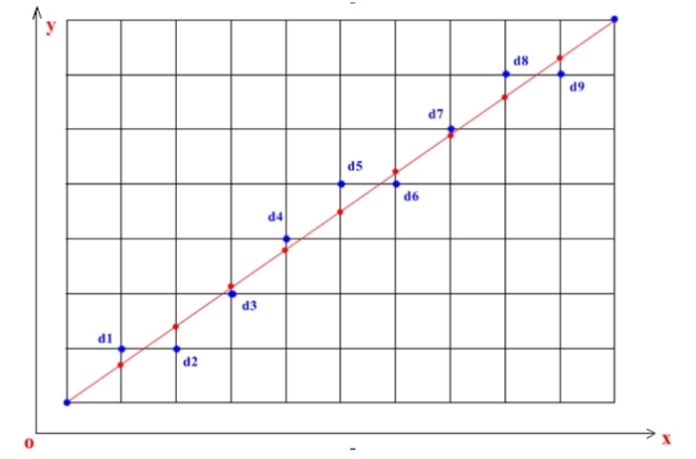
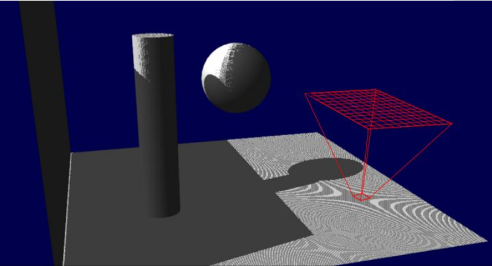

# 软渲染相关内容

## 渲染管线概念

<br></br>


<br></br>


## 代码实现

### 数学工具

1. 选择左手坐标系 或 右手坐标系  
2. 向量类及其运算: 加(减法用加负数代替)，乘(除法用乘以倒数代替)，点乘，叉乘，归一化，计算长度，和向量乘，和标量乘，和向量加，和标量加 等
3. 矩阵类及其运算 (要先确定使用 矩阵\*向量 还是 向量\*矩阵)  : 和矩阵加，和矩阵乘，和向量乘，和标量乘，计算转置矩阵，构建平移旋转缩放矩阵，构建MVP矩阵，构建正交矩阵 等

&emsp; 需要留意法线的变换


```c++
Vector3 VectorAdd(const Vector3& vec1, const Vector3& vec2)
{
    Vector3 result;
    result.x = vec1.x + vec2.x;
    result.y = vec1.y + vec2.y;
    result.z = vec1.z + vec2.z;
    return result;
}

Matrix4x4 MatrixAdd(const Matrix4x4& m1, const Matrix4x4& m2)
{
    Matrix4x4 result;
    int i, j;
    for (i = 0; i < 4; i++)
    {
        for (j = 0; j < 4; j++)
        {
            result.m[i][j] = m1.m[i][j] + m2.m[i][j];
        }
    }
    return result;
}
```

[旋转矩阵](https://blog.csdn.net/csxiaoshui/article/details/65446125)

<br></br>

### 画直线
给定两个屏幕坐标点，画一条直线。  


选择一种划线方法，DDA法，Bresenham算法，中点画线法，吴小林直线算法。  
该直线不涉及模型空间到投影空间的坐标变换。用来理解画线方法原理，熟悉gdi的基本使用。

<br></br>

### 三角形光栅化

1. 初始化模型空间的三个顶点(位置，uv，法线，切线等)，此处只用到位置信息，经过 MVP 矩阵的变换，得到裁切空间的三个点，  
2. 每个点都进行透视除法(clippos.xyz /= clippos.w)后，坐标变到[-1,1]区间，映射到屏幕空间坐标(先从[-1,1]映射到[0,1], 再映射到[0,width]和[0,height])，此时得到屏幕上的三个点  
3. 光栅化，通过插值确定一个点的坐标，根据两个点画一条直线，从上到下或者从下到上依次画直线，最终在屏幕上画出一个三角形。(平底三角形，平顶三角形)


<br></br>

### 顶点颜色插值

光栅化时通过插值得到每个片元的颜色。

<br></br>

### 贴图
1. 把一张图片读进内存，声明一个二维数组，维度为图片的宽高，存储每个像素的颜色值
2. 光栅化时通过插值得到每个片元的uv
3. 把uv映射到图像大小的区间，[0, texWidth] 和 [0, texHeight]，用该坐标去读取对应的颜色

<br></br>

### 深度缓冲
画多个物体相互之间有遮挡时，使用深度测试可以确保画出的图像是正确的。

正确:  

<br></br>
错误:  


在管线中的阶段:


### 背面剔除
背面剔除可以确保看不到的三角面不被渲染出来，节省计算能力，提高帧率。
(也可以进行正面剔除)


1. 求出三角面中心点坐标  
centerPos = (pos1.xyz + pos2.xyz + pos3.xyz) * 0.3333;
2. 求出摄像机到中心点的向量  
camForward = centerPos - worldSpaceCameraPos;
3. 求出三角面的法向量，三个顶点两两相减得到从同一个顶点为源头的两个向量，叉乘可以得到法线向量，要注意叉乘顺序（和选择的坐标系有关）
v1Tov2 = v2 - v1;  
v1Tov3 = v3 - v1;  
normal = cross(v1Tov2, v1Tov3);  
isFrontFace = dot(camForward, normal) < 0;

<br></br>

### 立方体
第一感觉应该是有8个顶点，实际需要24个顶点，因为相邻面共用的顶点的uv和法线都不同，认定是两个顶点，而不是一个。当然，顶点的坐标位置只有8个，常见做法是声明一个长度是8的数组VertexArray，存放顶点位置，再声明一个长度是24的数组IndexArray，存储24个值在[0, 7]之间的数字，对应VertexArray中的第n个元素。


举例，以顺时针为正方向时
```c++  
VertexArray = 
{
    v0, v1, v2, v3, v4,v5, v6, v7
}

IndexArray = 
{
    // 正面 //
    // 2 1 0 画一个三角形，2 0 3 画一个三角形 //
    2,1,0,3,

    // 右面 //
    // 3 0 5 画一个三角形，3 5 4 画一个三角形 //
    3,0,5,4,

    ...
}

for (int i = 0; i < IndexCount; i += 4)
{
    v1 = VertexArray[i];
    v2 = VertexArray[i+1];
    v3 = VertexArray[i+2];
    v4 = VertexArray[i+3];
    DrawTriangle(v1, v2, v3);
    DrawTriangle(v1, v3, v4);
    ...
}
```

<br></br>

### 基础光照

环境光:
给一个固定值

漫反射:  

各种方向的示意图


diffuse = dot(normal, lightDir)


高光:  

phong 模型  


翻译成代码就是: 
```csharp 
float3 relfectDir = 2*dot(lightDir, normal)*normal - lightDir;
float specular = dot(relfectDir, lightDir);
```

blinn-phong 模型:
phong模型的改进版，简化了计算效果也不错。


翻译成代码就是: 
```csharp 
float3 halfDir = normalize(lightDir + viewDir);
float specular = dot(halfDir, normal);
```

<br></br>

### 使用法线图

从法线图中读取的是切线空间的法线，需要转换到指定的计算空间，比如世界空间。
构建变换矩阵 _World2Tangent 或 _Tangent2World。
世界空间的tangent，binormal(有争议，有的叫bitangent), normal，构成的矩阵是 _World2Tangent。
_Tangent2World 是_World2Tangent的逆矩阵，而_World2Tangent矩阵是正交矩阵，因此其转置矩阵就是逆矩阵。

```csharp
_World2Tangent = float3x3(tangent, binormal, normal);
_Tangent2World = float3x3(tangent.x, binormal.x, normal.x,
                          tangent.y, binormal.y, normal.y,
                          tangent.z, binormal.z, normal.z);
```
> 即 `_Tangent2World = _World2Tangent.Transpose`

正交矩阵举例:  
1 0 0  
0 1 0  
0 0 1  

<br></br>

### 阴影

1. 把场景中需要产生阴影的物体转换到灯光空间（正交投影矩阵）
2. 记录举例灯光最近的深度值作为shadowmap
3. 正常渲染所有物体，渲染时把物体坐标转换到灯光空间，对比其深度值(depth)和shadowmap中记录的深度值(depthInSM)，如果 depth > depthInSM 表示在阴影中，否则不在阴影中。

&emsp; shadow acne 问题

<br></br>

&emsp; 成因

<br></br>


<br></br>

### 多线程，提高帧率

   1. 声明几个工作线程，while(true)，每个线程有自己的queue，存放渲染任务
   2. 把渲染任务拆分成多个子任务添加到工作线程的queue中

&emsp; 注意从queue中读取任务时要使用互斥锁(std::mutex)，避免出现效果错误或报错。

<br></br>


### 参考链接:  
&emsp;  https://blog.csdn.net/shimazhuge/article/details/83377155

&emsp;  https://blog.csdn.net/chenjiayi_yun/article/details/38601439

&emsp;  https://zh.wikipedia.org/wiki/%E5%90%B4%E5%B0%8F%E6%9E%97%E7%9B%B4%E7%BA%BF%E7%AE%97%E6%B3%95

&emsp;  https://blog.csdn.net/puppet_master/article/details/80317178

&emsp;  https://learnopengl-cn.readthedocs.io/zh/latest/04%20Advanced%20OpenGL/01%20Depth%20testing/

&emsp;  https://en.wikipedia.org/wiki/Phong_reflection_model

&emsp;  https://en.wikipedia.org/wiki/Blinn%E2%80%93Phong_shading_model

&emsp;  https://zh.wikipedia.org/wiki/%E6%AD%A3%E4%BA%A4%E7%9F%A9%E9%98%B5

&emsp;  https://learnopengl.com/Advanced-Lighting/Shadows/Shadow-Mapping

&emsp;  https://www.zhihu.com/question/49090321

