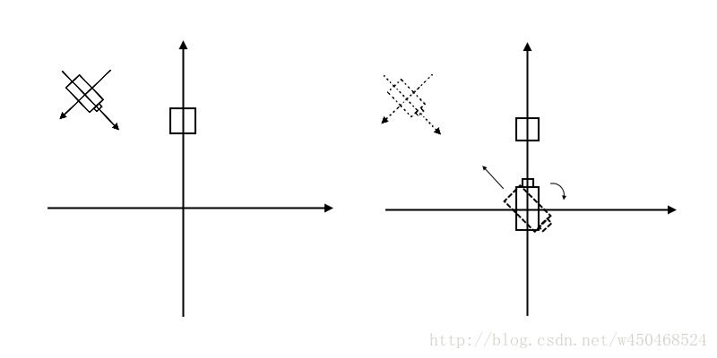
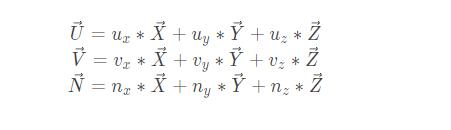

# View矩阵

>engine.c 中 matrix_set_lookat方法解释：

## 构建出相机空间的坐标系

1. 获取相机镜头方向forward向量并归一化，它是Z轴，记为N。
2. 利用相机镜头方向forward向量与相机上方向up向量，叉乘得出side向量并归一化，它是X轴方向，记为U。
3. 利用U向量和N向量进行叉乘，重新计算出up向量并归一化，保证三轴一定相互垂直。记此向量为V。
4. 完成以上三步后，得到的是一个左手坐标系，将向量N取，即可得到一个右手坐标系。

## 求世界坐标到相机空间坐标的变换矩阵

想要从世界坐标到相机空间坐标，一般需要做两步变换：

1. 旋转世界坐标，使世界坐标和相机空间坐标三轴方向一致，我们把这个旋转矩阵记作R.

将世界坐标矩阵看做是一个向量空间，对于这个向量空间， X轴单位向量X（1,0,0）、Y轴单位向量Y（0,1,0）和Z轴单位向量Z（0,0,1）可以看做是这个向量空间的基。

而构建出的相机空间坐标的三个单位向量，显然也可以看做是这个向量空间的基。

从世界坐标到相机空间坐标的变换，实际上就是基变换，求基变换的过度矩阵。从X、Y、Z基到U、V、N的基变换，很明显有：

所以，很明显可以得到一个R矩阵：

2. 平移旋转后的世界坐标，使其与相机空间坐标完全重合，我们把这个平移矩阵记作T，T的矩阵很明显就是：

 

3. 最终要求的相机变换矩阵即为：M=R*T， 那么对于物体来讲，物体的变换就是 M的逆， 基矩阵的逆即M的转置:

