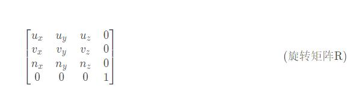

# View矩阵


## 构建出相机空间的坐标系  View-Matrix

>engine.c 中 matrix_set_lookat

1. 获取相机镜头方向forward向量并归一化，它是Z轴，记为N。
2. 利用相机镜头方向forward向量与相机上方向up向量，叉乘得出side向量并归一化，它是X轴方向，记为U。
3. 利用U向量和N向量进行叉乘，重新计算出up向量并归一化，保证三轴一定相互垂直。记此向量为V。
4. 完成以上三步后，得到的是一个左手坐标系，将向量N取，即可得到一个右手坐标系。


## 求世界坐标到相机空间坐标的变换矩阵

想要从世界坐标到相机空间坐标，一般需要做两步变换：

1. 旋转世界坐标，使世界坐标和相机空间坐标三轴方向一致，我们把这个旋转矩阵记作R.

将世界坐标矩阵看做是一个向量空间，对于这个向量空间， X轴单位向量X（1,0,0）、Y轴单位向量Y（0,1,0）和Z轴单位向量Z（0,0,1）可以看做是这个向量空间的基。

而构建出的相机空间坐标的三个单位向量，显然也可以看做是这个向量空间的基。

从世界坐标到相机空间坐标的变换，实际上就是基变换，求基变换的过度矩阵。从X、Y、Z基到U、V、N的基变换，很明显有：


所以，很明显可以得到一个R矩阵：



2. 平移旋转后的世界坐标，使其与相机空间坐标完全重合，我们把这个平移矩阵记作T，T的矩阵很明显就是：


3. 最终要求的相机变换矩阵即为：M=R*T， 那么对于物体来讲，物体的变换就是 M的逆， 基矩阵的逆即M的转置:


## 正交投影 rtho-Projection-Matrix

>engine.c 中 matrix_set_ortho

正交投影一般有两个输入参数，分别位左边界l、右边界r、上边界t、下边界b、近平面n以及远平面f。

假设经过模型空间的一点P(x,y,z)，经过model和view矩阵变换后，得到了点P1(x1,y1,z1)，P1经过了正交投影矩阵变换后，得到点P2(x2,y2,z2)，点P2的xyz分量都应该在[-1,1]区间。

P到P1的变换由Model和View矩阵决定，而P1到P2的变换由投影矩阵决定。

由正交投影的六个参数可以构成一个立方体，只有在立方体中的点，才会投影到屏幕上。而且很明显正交投影，点的x、y坐标是不会发生变换的（同一物体远处投影和近处投影，投影结果大小不变，也就是xy坐标不变）。

作出XOZ平面的投影如下（YOZ投影基本类似），从图中可以看出，如果P1点的X坐标确定，则无论Z轴如何变换，P2的X坐标也不会变换，对于Y坐标同样如此。也就是在正交投影下，P2的X坐标只和P1的X坐标相关，P2的Y坐标只与P1的Y坐标相关。


而根据上面分析，P1应该在正交投影的六个参数构建的立方体中，即z1的取值范围应为[n,f]。

而按照gl默认的设置，对应的k的范围应该位[0,1]（归一化设备坐标），当NDC不做任何设置时，其采用的是左手坐标系，所以对于公式(3)应该有：
```c
a22*n + a32 = 0; 
a22*f + a32 = 1;
```

求得：
```c
a22 = 1/(f-n);
a23 = n/(n-f);
```

于此同理，根据x1和y1的取值范围x1∈[l,r] ，y1∈[b,t]，归一化设备坐标取值[-1,1]  求得
```c
a00 = 2/(r-l);
a11 = 2/(t-b);
a30 = (l+r)/(l-r);
a31 = (t+b)/(b-t);
```

注意上面的关于z值的取值范围和xy是不同的，dx中z的取值范围是[-1,1]。  

openGL默认情况下，在片源着色器中gl_FragCoord.z的深度取值范围是[0, 1]，注意，NDC坐标系中的z的取值范围是[-1, 1]，

z值的坐标范围之所以能从NDC坐标系中的[-1，1]转变到屏幕坐标系中的[0, 1]，

是因为OpenGL会根据函数glDepthRange(nearVal, farVal)中nearVal与farVal的值，

将NDC坐标系中z从[-1, 1]映射到[nearVal, farVal]，这一映射就是简单地线性变换。

其中，如果没有主动调用过glDepthRange，那么OpenGL就认为nearVal就是0，farVal就是1。


## 透视投影 perspective-projection-matrix

>engine.c 中 matrix_set_perspective

透视投影推导和正交投影有共通之处，和正交投影不同的是，透视投影下的物体，最终投影出来的结果会呈现出近大远小的效果。

透视投影矩阵的输入参数一般是四个，广角fov(广角有fovx和fovy两种，本篇博客中采用fovx)、高宽比aspect、近平面near、远平面far。

同透视投影一样，假设P(x,y,z)经过Model和View矩阵变换，得到P1(x1,y1,z1)，然后经过透视投影矩阵变换，可以得到P2(x2,y2,z2)，

同正交投影一样，P2的xy三个分量也都应该在[-1,1]区间，z在[0-1]区间， 我们所需要关注的依旧是P1到P2的过程。

有透视投影矩阵的输入参数，可以构建出一个缺少顶部的金字塔的立体，这个就是透视投影的视锥，只有在视锥中的点才会投影到屏幕上。

和正交投影不同的是，透视投影下会有近大远小的效果，所以投影前后的x,y左边不再相同。

构建出P1、P2及视锥图在XOZ平面下的投影图。从图中可以看出，一般情况下，当P1的Z坐标发生变化时，P2的X坐标也会发生变换。同样Y坐标也是如此


