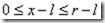
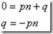

# View矩阵


## 构建出相机空间的坐标系  View-Matrix

>engine.c 中 matrix_set_lookat

1. 获取相机镜头方向forward向量并归一化，它是Z轴，记为N。
2. 利用相机镜头方向forward向量与相机上方向up向量，叉乘得出side向量并归一化，它是X轴方向，记为U。
3. 利用U向量和N向量进行叉乘，重新计算出up向量并归一化，保证三轴一定相互垂直。记此向量为V。
4. 完成以上三步后，得到的是一个左手坐标系，将向量N取，即可得到一个右手坐标系。


## 求世界坐标到相机空间坐标的变换矩阵

想要从世界坐标到相机空间坐标，一般需要做两步变换：

1. 旋转世界坐标，使世界坐标和相机空间坐标三轴方向一致，我们把这个旋转矩阵记作R.

将世界坐标矩阵看做是一个向量空间，对于这个向量空间， X轴单位向量X（1,0,0）、Y轴单位向量Y（0,1,0）和Z轴单位向量Z（0,0,1）可以看做是这个向量空间的基。

而构建出的相机空间坐标的三个单位向量，显然也可以看做是这个向量空间的基。

从世界坐标到相机空间坐标的变换，实际上就是基变换，求基变换的过度矩阵。从X、Y、Z基到U、V、N的基变换，很明显有：


所以，很明显可以得到一个R矩阵：


2. 平移旋转后的世界坐标，使其与相机空间坐标完全重合，我们把这个平移矩阵记作T，T的矩阵很明显就是：


3. 最终要求的相机变换矩阵即为：M=R*T， 那么对于物体来讲，物体的变换就是 M的逆， 基矩阵的逆即M的转置:


投影矩阵推导(翻译)
原网址：http://www.codeguru.com/cpp/misc/misc/graphics/article.php/c10123/Deriving-Projection-Matrices.htm

3D矩阵变换中，投影矩阵是最复杂的。位移和缩放变换一目了然，旋转变换只要基本的三角函数就能想象出来，投影矩阵则很难凭借直觉想象出来。

总述：什么是投影

计算机显示屏是二维平面，所以如果你想显示三维物体，需要找到把三维物体渲染成二维图像的方法。这正是投影要做的。最简单的做法：直接丢掉三维物体各顶点的Z坐标。对于一个立方体，看起来像图1：


这种投影简单且不实用。所以，一开始就不应该投影到“面”（plane）上，而应该投影到一个“体”（volume）内，即所谓的“规范视域体”（canonical view volume）。规范视域体的顶点坐标在不同的API（DirectX/OpenGL）中有所不同。这里就用D3D的标准，从 （-1,-1,0）到（1,1,1）。当所有的顶点映射到规范视域体中后，XY坐标用来再映射到屏幕上。Z坐标看起来无用，不过通常用来表示深度信息。这也是为什么会投影到一个“体”，而不是“面”的原因。

下面将讲述两种常见变换：正交变换、透视变换。

## 正交变换

“正交”的由来是投影线与显示平面垂直，是一种相对简单的投影技术。“视体”——眼睛可见的所有几何体的空间——是个各边与坐标轴平行的盒子，现在要把这个盒子映射到规范视域体中，如图所示：


正如你所见到的，视体（view volume）可以由6个面定义：
```
Left: x = l
Right: x = r
Bottom: y = b
Top: y = t
Near: z = n
Far: z = f
```
因为视体（view volume）和规范视域体（canonical view volume）的轴都与坐标轴平行，所以在这种投影中，对距离没有修正（correction）（这里指的是近大远小）。实际上，它非常像 图1 那种，直接扔掉各点Z坐标的做法。在3D空间中，同样大小的物体，投影后，在投影空间也是一样大，即使其中一个距离摄像机比另一个远很多也不会有不同。3D空间中平行的线在投影后依然平行。这种投影不可能用于第一人称射击游戏，因为它不能区分出物体的远近。但是它确实有自己的用途。你可以把它用在基于格子的游戏中，特别是当摄像机处于固定角度时，正如 图3所示的那样：


下面来看看它（正交投影）是怎么工作的。简单地，可以将三个坐标轴分开考虑，分别计算如何将各点（在某个轴上）的坐标（3D空间中），映射到规范视域体中（投影空间）。先算X轴。视体中的坐标处于 [l, r] 区间，现在要把它映射到 [-1, 1] 区间：


在进行缩放前，要将区间的左边归 0。简单地，将 X 坐标减去l：



现在区间的左边已经是 0 了，可以将它缩放到需要的尺寸。我们想要的投影后的区间长度为 2（-1 到 1），所以将 X 坐标乘 2/(r-l)。因为 r – l 就是视体的宽度，所以它总为正数，不用担心它会改变不等号方向：


接下来，将结果减去 1，让它落在 [-1, 1] 区间：


整理一下：


好了，下面要把得到的结果分解成 px + q 这样的形式，因为这样方便转换成矩阵形式：


上面式子的中间部分，就是将3D空间中的 X 转换到规范视域体的算式：


对于Y轴也应用同样的过程：


类似的过程也应用于Z轴。这会有一点点的不同，因为Z的范围是 [0, 1]，而不是 [-1, 1]。但它们看起来会很相似。

开始：


接着：


再接着：


再接着：


最后：


现在，我们已经做好准备，能写出正交变换矩阵了。这里有三个算式：


把它们写成矩阵：


这就是我们要得到的结果！

D3D提供了一个叫 D3DXMatrixOrthoOffCenterLH() 的函数来构建正交变换矩阵。LH表示这个函数使用的是左手坐标系。那么，OffCenter 是什么鬼？

这个问题涉及一个形式更简单的正交变换矩阵。

考虑这样一些点：

1. 在眼睛所在的空间里，摄像机处于原点；

2. 通常，我们希望视场（Field of View）相对于Z轴左右对称，上下对称。

如此的话，Z轴就直接从视体（View Volume）的中间穿过。所以有 r = -l，t = -b。换句话说，可以不去管 r，l，t和b，只需要视体（view volume）的宽w和高h，加上裁剪平面f和n，就可以定义视体了。如果使用新的定义，将得到一个更简单的投影矩阵版本：


D3DXMatrixOrthoLH() 方法实现了这个矩阵的算法。大多数情况下可以直接使用这个版本，而不是那个更通用的“off center”版本。

在结束这个小节前，我们再深入一点点。这个正交变换矩阵可以表示为两个稍微简单点的矩阵的乘积：平移矩阵和缩放矩阵。不难理解，因为正交变换相当于把点从一个坐标轴平行的盒子里变换到另一个坐标轴平行的盒子里。视体（Viewing Volume）并没有改变物体的形状，只改变了位置和大小。更准确地说：


上面的乘积更直观。首先，视体沿着Z轴平移，让它的近平面与原点重合；接着，对它进行缩放。让它的大小与规范视域体（Canonical View Volume）相同。这个很好理解吧？Off Center版本的投影矩阵也可以被表示为一个平移和缩放矩阵的乘积。

以上是正交变换矩阵的所有内容，接下来试试点挑战。

## 透视投影

透视投影相对复杂一点，也更常用。因为它给人一种近大远小的错觉，所以感觉上更真实。

从几何上说，这种投影与正交投影的不同在于：透视投影的视域（View Volume）是一个截头锥体，就是一个截掉头部的金字塔形状，而不是一个各边与坐标轴平行的盒子。如图4：


如你所见，视体的近平面是一个左下角（l，b，n）到右上角（r，t，n）的长方形。远平面则是从原点到近平面的四个顶点作射线，与平面z = f相交，得到的四个点构成的长方形。因为视锥（View Frustum）距离原点越远越宽，又因为要把这个视锥体变换到规范视域体（canonical view volume）中。而规范视域体是一个各边与坐标轴平行的盒子。所以视锥的远端（比较粗的一头），相对于近端（比较细的一头）压缩的程序更大。这也是“近大远小”的原因。

因为视锥在变换的过程中形状发生了变化，所以透视投影不能简单地分解成平移和绽放变换。不过这并不意味着在正交投影下的工作白费。数学上常用的方法就是把一个复杂问题分解成简单问题嘛。上次（正交变换），我们一次考虑一个坐标轴。而这次，将把x，y坐标一起考虑，最后再处理z坐标。X，y坐标的处理分2步进行：

1. 给定一个点视锥内的点（x，y，z），将它投影到近平面 z = n上。因为抽影在近平面上，所以x落在区间 [l，r] 内，y落在 [b, t] 内。

2. 类似正交投影矩阵中的那样，将新的x坐标（投影到近平面上的）从 [l，r] 映射到 [-1，1]，新的y坐标从 [b，t] 映射到 [-1，1]。

看起来不错?见图：


如图 5，从点（x，y，z）向原点作直线，直线与 z = n平面（近平面）相交于图中黑色的点。从这些点向z轴作两条垂线，突然你就得到了两个相似三角形:D。如果想不起相似三角形是啥，翻翻高中课本就知道了。

根据勾股定理，从（x，y，z）向z轴作的垂线长度为：


从近平面上的交点（黑色点）到z轴作的垂线的长度：


投影点的x坐标为 x * n / z，y坐标为 y * n / z。（其实不用勾股定理，直接由相似三角形就得到结果了。）

这就是第1步的内容。

第2步类似正交变换中的，将x，y坐标映射到规范视域体：


公式是一样的，只是要把x用x * n / z代替，y用 y * n / z 代替：


两边同乘z：


这个结果有点奇怪。想要把它写成矩阵的话，需要写成这种格式：


不过上面的式子不是这样的，看起来似乎不对:p。

怎么办呢？我们已经得到了x’z，y’z的表达式，如果同样能获得类似的z’z的表达式，就能获得将（x，y，z）映射到（x’z，y’z，z’z）的矩阵。将它们同除z，就能获得（x’，y’，z’）了。

Z到z’的变换不依赖x，y。因为是线性变换，我们知道大概的变换公式是这样的：z’z = pz + q，其中p，q是常数。要确定这两个常数也容易，因为有两个特殊点。要映射 [n，f] 到 [0, 1]，所以当 z = n时，z’ = 0，当 z = f 时 z’ = 1。将这两组值代入 z’z = pz + q，可以解出 p，q。

第 1 组值：



第 2 组值：


结果：


这样就获得了z’z的表达式：


快完成了。不过因为结果需要用齐次坐标来表示。原来，我们直接把齐次坐标的第四个分量写成 z，即 w = z，现在我们要的是（x’z，y’z，z’z，w’z）。


将它写成矩阵形式：


当我们把这个矩阵应用于点（x，y，z，1）时，我们获得的是（x’z，y’z，z’z，z）。接着我们会做齐次坐标常做的处理：同除第四个分量。这样就得到了（x’，y’，z’，1）。

这就是投影矩阵了。D3DXMatrixPerspectiveOffCenterLH()函数实现了上面的公式。

如果视锥是以z轴为中心对称的（r = -1，t = -b）。投影矩阵可以用视锥的宽和高来表示：


D3D也有一个这种形式的函数：D3DXMatrixPerspectiveLH()。

最后，还有一种表示也很方便。在这种形式中，并不考虑视锥参数，而是使用摄像机的参数。图6展示了这个概念：


视锥的高度用相机的视角来表示。相机的视角用α表示，则α被z轴平分。α与视锥的宽和高的关系如下：


这样可以替换掉公式中的高度。更进一步，还可以将宽度替换为（屏幕的）高宽比r。


这样就获得了一个用视角和高宽比表示的投影矩阵：


D3D中，可以用D3DXMatrixPerspectiveFovLH()来获得这个形式的投影矩阵。这种形式的矩阵比较方便，因为只要设置好屏幕高宽比，和相机视角（一般90度），剩下的就只要关心视锥在z轴上的位置就行了。

这就是投影矩阵的推导过程。如果你用的是右手坐标系，可能会有所不同。


### 总结下，正交投影变换w前后不改变，如果没有改过，变换前后都是1， 但是透视变换w'=z, 而z'是只跟z正线性相关的变量，x'是x,z线性相关的，同理y'和y,z现行相关。
