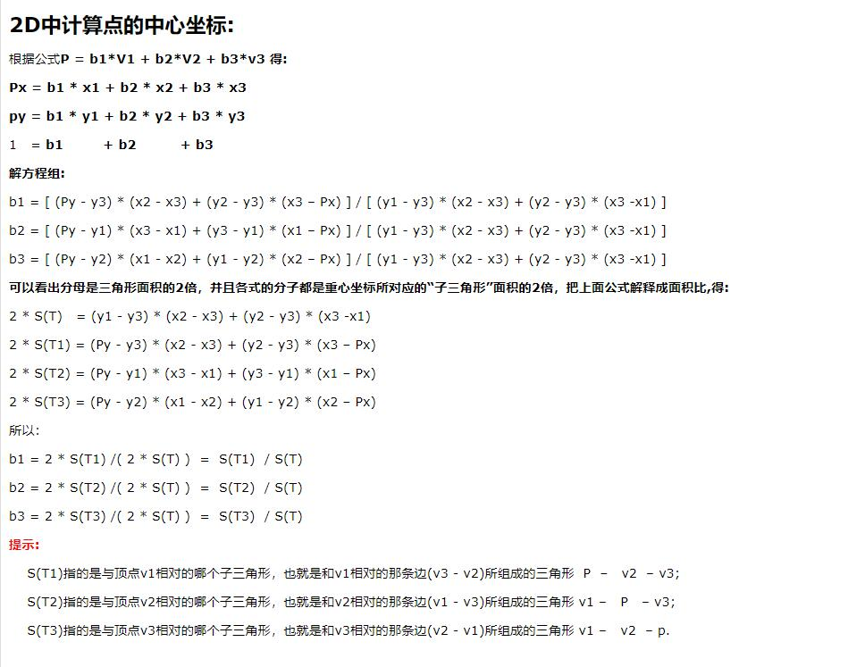
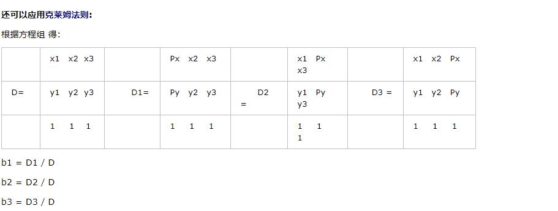
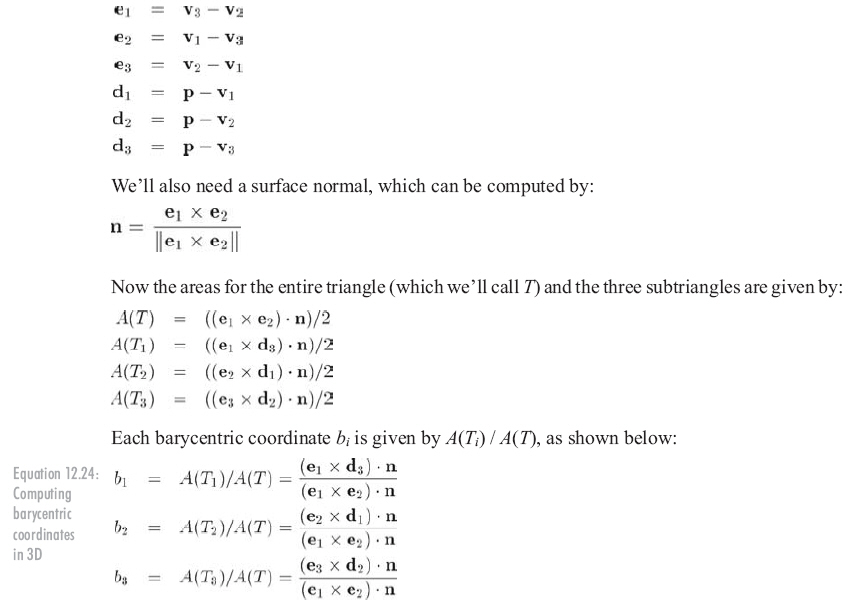
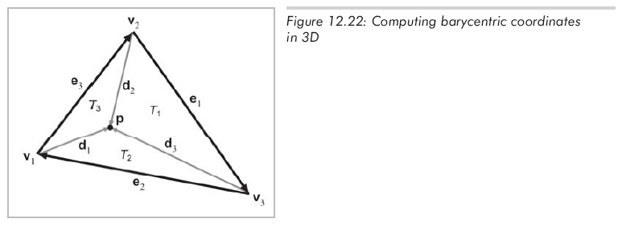

# 3D中计算点的重心坐标

## 重心坐标系:
我们经常碰到需要知道三角形上某个点的坐标，比如射线和三角形的焦点
那么我们就需要一个能与三角形表面相关联并且独立于三角形所在3D坐标空间，这样重心坐标空间就诞生了.

三角形所在平面任一点都能表示为顶点的加权平均值。这个权就称作重心坐标. 从重心坐标(b1,b2,b3)到标准3D的转换为:
p = b1 * V1 + b2 * V2 + b3 * v3

重心坐标的中和为1 即：
b1 + b2 + b3 = 1

比如 三角形顶点v1的重心坐标就是(1,0,0),3D坐标就可以表示为:
p = b1 * v1 + b2 * v2 + b3 * v3
p = 1 * v1 + 0 * v2 + 0 * v3
p = v1

其他两个顶点同理。

由此可以看出，三角形三个顶点重心坐标都是单位向量，即:
v1 = (1,0,0)
v2 = (0,1,0)
v3 = (0,0,1)

注意：
不只是三角形内的点，该平面上的所有点都能用重心坐标描述。三角形内的点重心坐标在0到1之间的变化, 三角形外的点至少有一个坐标为负。重心坐标用和原三角形大小相同的块“镶满”整个平面.

还可以应用克莱姆法则:

## 3D中计算点的重心坐标:
计算3D中任意点的重心坐标比在2D中复杂，不能再像以前那样解一个方程组了，因为有三个未知数和四个方程。另一个导致复杂性的地方是p可能不在三角形所在的平面中，这时重心坐标没有意义，但现在我们假设p在三角形所在的平面上。
一种技巧是通过抛弃x、y、z中的一个分量，将3D问题转化到2D中，这和将三角形投影到三个基本平面中某一个上的原理相同。理论上，这是能解决问题的，因为投影面积和原面积成比例。
那么应该抛弃哪个坐标呢？不能总是抛弃某一个，因为如果三角形垂直于某个平面，投影点将共线。如果三角形接近垂直于投影平面，会遇到浮点数精度问题。一种解决方法是挑选投影平面，使得投影面积最大。这可以通过检查平面的法向量做到，我们要抛弃的就是绝对值最大的坐标。例如，法向量为[-1, 0, 0]，我们将抛弃顶点p的x分量，把三角形投影到yz平面。
另一种计算3D重心坐标的方法基于用向量叉乘计算3D三角形面积的方法。给出三角形的两个边向量e1和e2，三角形面积为||e1x e2|| / 2。一旦有了整个三角形的面积和三个"子三角形"的面积，就能计算重心坐标了。

还有一个小小的问题：叉乘的大小对顶点的顺序不敏感。根据定义，叉乘大小总是正的。这种方法不适用于三角形外的点，因为它们至少有一个负的重心坐标。

看看能否找到解决问题的思路。当顶点以"不正确"的顺序列出时，向量叉乘的大小可能会是负值，我们需要一种正确计算的方法。幸运的是，有一种非常简单的方法能做到这一点：点乘。

设c为三角形两个边向量的叉乘，c的大小等于三角形面积的两倍。设有一个单位法向量n，n和c是平行的，因为它们都垂直于三角形所在的平面。当然，它们的方向可能是相反的。两向量的点乘等于它们大小的积再乘以它们夹角的cos值。因为n是单位向量，不管n和c方向相同还是相反，都有：

c . n = ||c|| ||n|| cosθ = ||c|| (1) (±1) = ±||c||

将这个面积除以2，就得到了3D中三角形的"有符号"面积。有了这个技巧，就能利用前一节的结论：bi就是"子三角形"Ti的面积占整个三角形面积的比。如图12.22所示，标出了所有用到的向量。

## 特殊点

重心是三角形的最佳平衡点，它是三角形三条中线的交点（中线指从顶点到对边中点的连线）。图12.23展示了一个三角形的重心。

### 参考链接:  
&emsp; https://www.cnblogs.com/ThreeThousandBigWorld/archive/2012/08/31/2665418.html
